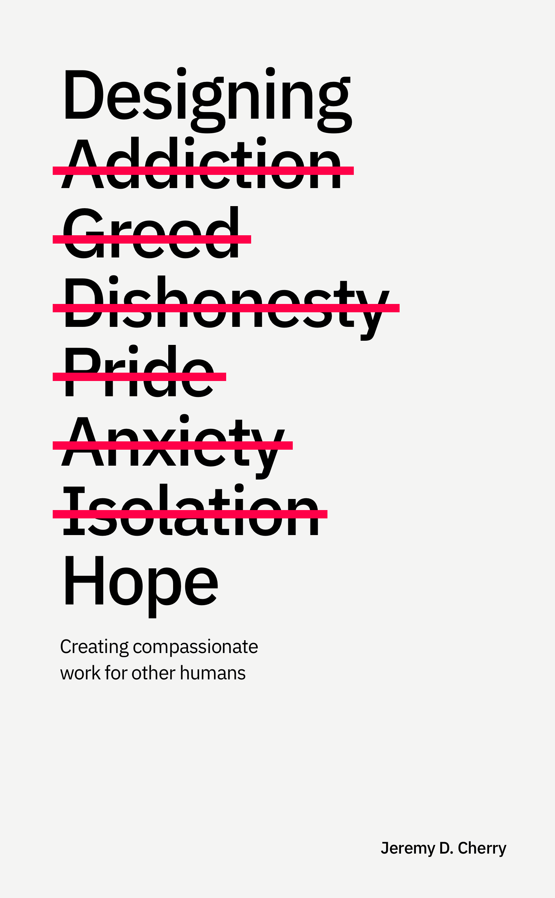

  

  

    

        <h1>Designing Hope</h1>
        <h2>by <a href="https://jeremydcherry.com">Jeremy D. Cherry</a></h2>
        <em>Designing Hope</em> is a book that explores creating compassionate work for other humans. It defines a framework that creates hope by practicing in an ecosystem, honoring that community with its solutions and sharing in the responsibility of its outcomes. It’s equal parts manifesto and practical guide. In short, if you create things for others <em>(you do)</em>, this book is for you. 
        <a href="/toc"><button>Start Reading</button></a> 
        <h6>Or if you'd prefer <a href="/download">download</a> it or give it a <a href="/listen">listen</a>.</h6>
    

  

